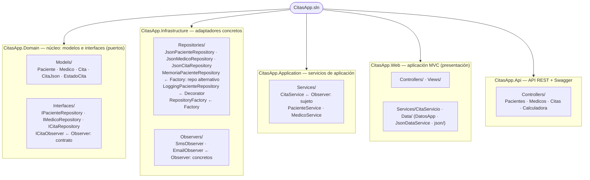
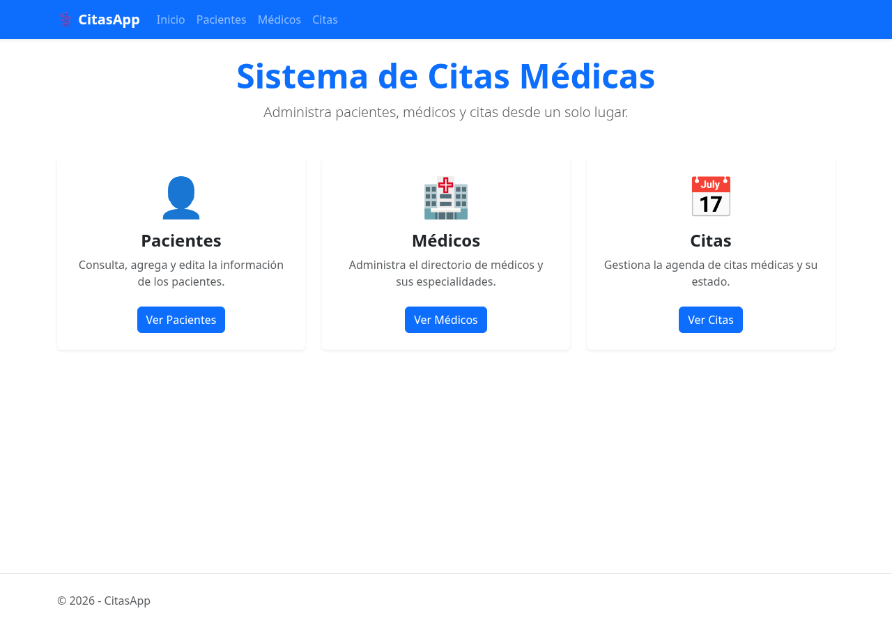
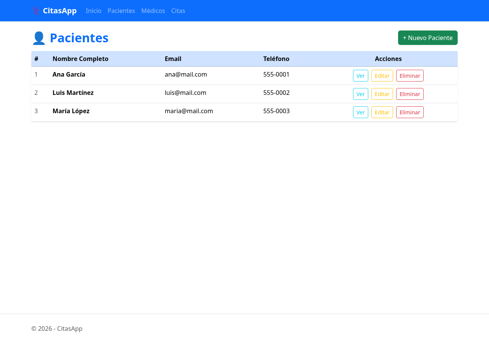
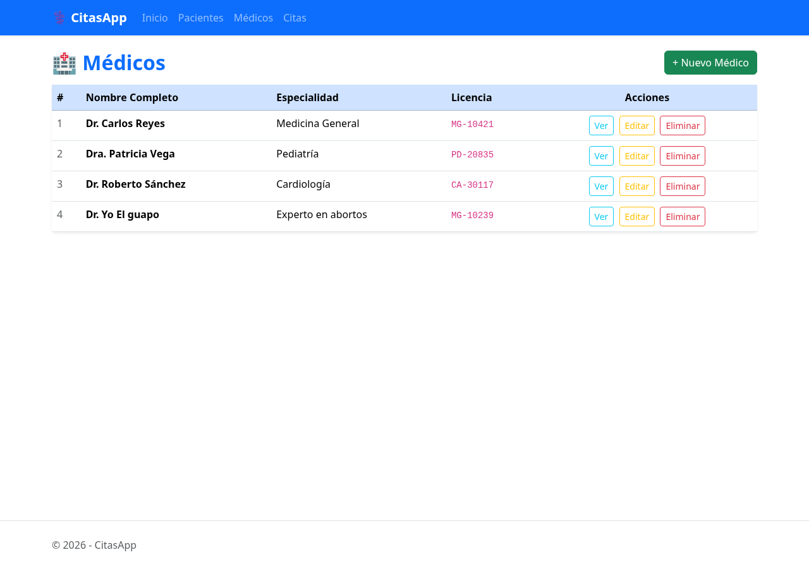
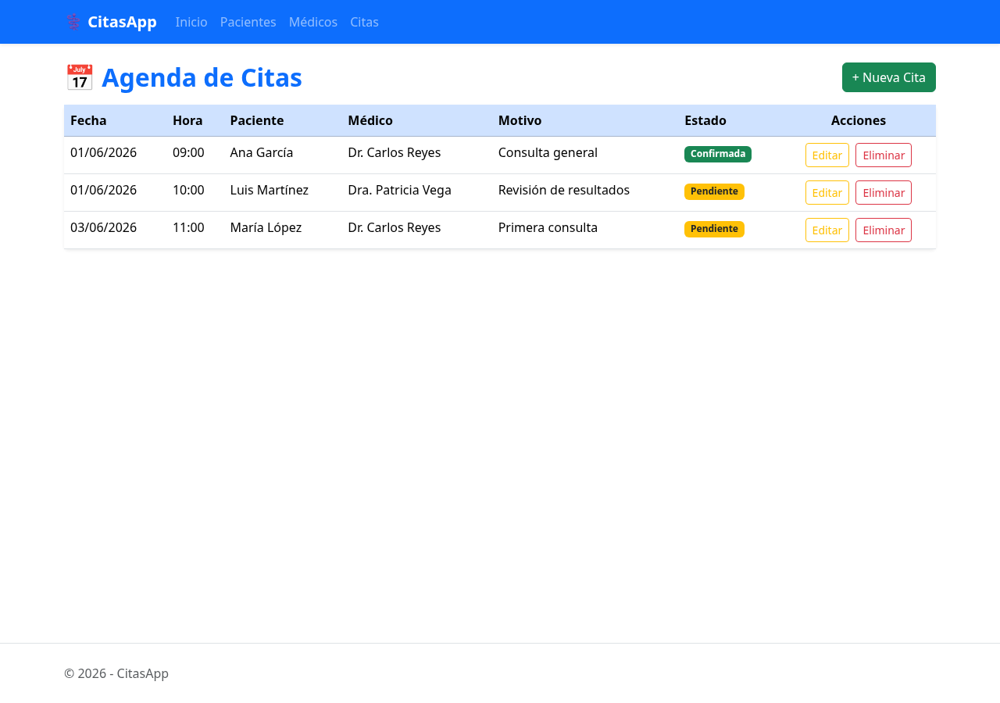

# CitasApp — Sistema de Citas Médicas

Aplicación web MVC para la gestión de citas médicas. Permite administrar pacientes, médicos y citas con persistencia de datos en archivos JSON, organizada en una **arquitectura hexagonal multi-proyecto**.

> 📐 **Documentación técnica y diagramas (Mermaid):** [`docs/DIAGRAMAS.md`](docs/DIAGRAMAS.md) — **modelo C4** (Contexto → Contenedores → Componentes → Código), patrones GoF y flujos de ejecución que reflejan el estado real del proyecto.

## Descripción

CitasApp es un sistema que permite:

- Registrar y administrar **pacientes** con su información de contacto.
- Gestionar el directorio de **médicos** y sus especialidades.
- Programar **citas** médicas asignando paciente, médico, fecha, hora y motivo.
- Ver el estado de cada cita (Pendiente, Confirmada, Cancelada).
- Persistencia total: los datos se guardan en archivos JSON y se mantienen entre reinicios de la aplicación.

## Qué se hizo

Se desarrolló la aplicación con **arquitectura hexagonal** (puertos y adaptadores), separando la solución en tres proyectos con responsabilidades claras:

| Proyecto | Capa | Contenido |
|---|---|---|
| **CitasApp.Domain** | Dominio (núcleo) | Modelos (`Paciente`, `Medico`, `Cita`, `CitaJson`, `EstadoCita`) y puertos: interfaces de repositorio (`IPacienteRepository`, `IMedicoRepository`, `ICitaRepository`). No depende de nada. |
| **CitasApp.Infrastructure** | Infraestructura (adaptadores) | Implementaciones de los repositorios sobre archivos JSON (`JsonPacienteRepository`, `JsonMedicoRepository`, `JsonCitaRepository`). Depende solo de Domain. |
| **CitasApp.Web** | Presentación | Controladores MVC, vistas Razor, `Program.cs` e inicialización de datos (`DatosApp`, `JsonDataService`). Depende de Domain e Infrastructure. |

Con esto, el dominio queda aislado de los detalles de persistencia: la capa web consume las abstracciones del dominio y la infraestructura provee los adaptadores concretos, de modo que el almacenamiento JSON podría reemplazarse (por ejemplo, por una base de datos) sin tocar el núcleo de la aplicación.

Sobre esta base se implementó:

- Modelos de dominio: `Paciente`, `Medico`, `Cita` y el enum `EstadoCita`.
- Controladores MVC con acciones de listado, detalle, creación y edición para cada entidad.
- Vistas Razor con Bootstrap y navegación global mediante navbar.
- Persistencia en archivos JSON con `System.Text.Json`, con datos semilla (*seed*) cuando no existen archivos previos.

## Patrones de diseño GoF implementados

### Factory — `RepositoryFactory`

Clase estática en `CitasApp.Infrastructure/Repositories/RepositoryFactory.cs` que centraliza la decisión de qué repositorio instanciar según el entorno de ejecución:

- **`"Production"`** → `MemoriaPacienteRepository` (simula una base de datos SQL en memoria)
- **Cualquier otro entorno** → `JsonPacienteRepository` (persistencia en archivo JSON)

```csharp
var repo = RepositoryFactory.CrearPacienteRepository(
               builder.Environment.EnvironmentName, dataPath);
```

Esto desacopla al consumidor del repositorio concreto: cambiar de JSON a SQL solo requiere modificar la Factory, sin tocar ningún controlador.

### Decorator — `LoggingPacienteRepository`

Clase en `CitasApp.Infrastructure/Repositories/LoggingPacienteRepository.cs` que implementa `IPacienteRepository` y **envuelve** a otro repositorio real, añadiendo logging en consola antes y después de cada operación sin modificar el repositorio original.

```
IPacienteRepository
    ↑ implementa
LoggingPacienteRepository  →  delega a  →  JsonPacienteRepository
```

Al navegar a `/Paciente` se ve en la terminal:

```
[2026-06-24 09:54:28] ObtenerTodos — inicio
[2026-06-24 09:54:28] ObtenerTodos — 3 registros
```

En `Program.cs` se conectan Factory y Decorator:

```csharp
builder.Services.AddScoped<IPacienteRepository>(sp =>
{
    var repo = RepositoryFactory.CrearPacienteRepository(entorno, dataPath);
    return new LoggingPacienteRepository(repo);  // Decorator envuelve al repo
});
```

### Observer — `CitaService` + `SmsObserver` + `EmailObserver`

Sistema de notificaciones que se activa al confirmar una cita. Sigue el principio de que el **sujeto** (`CitaService`) no conoce a los observadores concretos — solo depende de la interfaz `ICitaObserver` definida en Domain.

| Clase | Capa | Rol |
|---|---|---|
| `ICitaObserver` | Domain | Contrato: `Notificar(Cita cita, string evento)` |
| `SmsObserver` | Infrastructure | Observador concreto — simula envío de SMS |
| `EmailObserver` | Infrastructure | Observador concreto — simula envío de email |
| `CitaService` | Application | **Sujeto** — mantiene la lista de observadores y notifica al confirmar |

`CitaService` solo importa namespaces de Domain (`CitasApp.Interfaces`, `CitasApp.Models`), nunca de Infrastructure. Los observadores concretos se suscriben desde `Program.cs` (capa Web), que es el único punto donde convergen todas las capas:

```csharp
builder.Services.AddSingleton<CitaService>(sp =>
{
    var service = new CitaService();
    service.Suscribir(new SmsObserver());    // Infrastructure
    service.Suscribir(new EmailObserver());  // Infrastructure
    return service;
});
```

Al editar una cita y cambiar su estado a `Confirmada`, el controlador llama a `citaService.Confirmar(cita)` y aparece en la terminal:

```
[2026-06-24 10:12:48] [SMS]   Cita #1 confirmada | Paciente=1  Médico=1  Fecha=01/06/2026  Estado=Confirmada
[2026-06-24 10:12:48] [EMAIL] Simulando envío → Cita #1 ha sido confirmada para el 01/06/2026 a las 09:00
```

## Preguntas de reflexión

**¿Qué principio SOLID aplica el Decorator al no modificar `JsonPacienteRepository`?**
El principio **Open/Closed (OCP)**: `JsonPacienteRepository` está cerrado a modificaciones pero abierto a extensión. El Decorator agrega comportamiento (logging) creando una nueva clase que envuelve a la existente, sin tocar su código.

**¿Qué principio SOLID aplica el Factory al centralizar la decisión de creación?**
El principio **Single Responsibility (SRP)**: ningún controlador ni servicio decide qué repositorio instanciar. Esa responsabilidad recae exclusivamente en `RepositoryFactory`, facilitando el mantenimiento y el cambio de estrategia de persistencia en un solo lugar.

**¿Podrías apilar dos Decorators? Por ejemplo: logging + caché. ¿Cómo lo harías?**
Sí. Cada Decorator implementa `IPacienteRepository` y recibe otro `IPacienteRepository` en su constructor, por lo que se pueden encadenar:

```csharp
var base   = new JsonPacienteRepository(dataPath);
var cached = new CachePacienteRepository(base);    // Decorator 1: caché
var logged = new LoggingPacienteRepository(cached); // Decorator 2: logging
```
Las llamadas fluyen: `LoggingPacienteRepository` → `CachePacienteRepository` → `JsonPacienteRepository`.

**¿Dónde agregarías `LoggingPacienteRepository` en el diagrama C4 de tu proyecto?**
En el nivel de **Componentes** (C4 nivel 3), dentro del contenedor `CitasApp.Infrastructure`. Aparecería como un componente entre `PacienteController` y `JsonPacienteRepository`, con una relación de delegación hacia el repositorio real y una dependencia de la interfaz `IPacienteRepository` definida en `CitasApp.Domain`.

## Estructura de la solución



> Diagramas más detallados (arquitectura, clases, patrones y flujos) en [`docs/DIAGRAMAS.md`](docs/DIAGRAMAS.md).

## Tecnologías

| Tecnología | Descripción |
|---|---|
| **ASP.NET Core 10** | Framework principal — patrón MVC |
| **C# 13** | Lenguaje de programación |
| **Razor Views** | Motor de vistas del lado del servidor |
| **Bootstrap 5** | Estilos y componentes visuales |
| **System.Text.Json** | Serialización/deserialización de datos JSON |
| **JSON (archivos)** | Capa de persistencia (`Data/json/`) |

## Capturas de pantalla

### Inicio


### Pacientes


### Médicos


### Citas


---

> **Nota:** Se utilizó IA (Claude) como apoyo durante el desarrollo, principalmente para corregir errores de compilación y resolver dudas técnicas puntuales.
