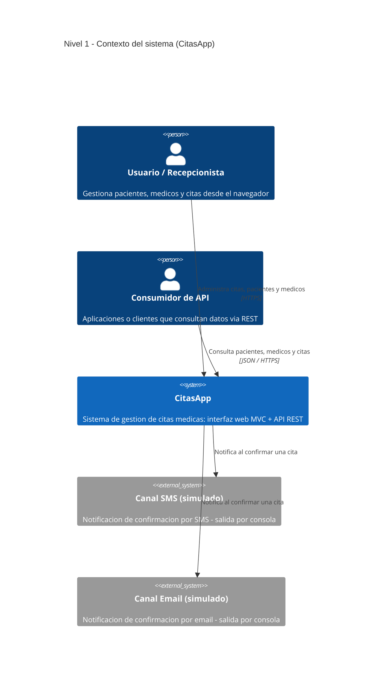
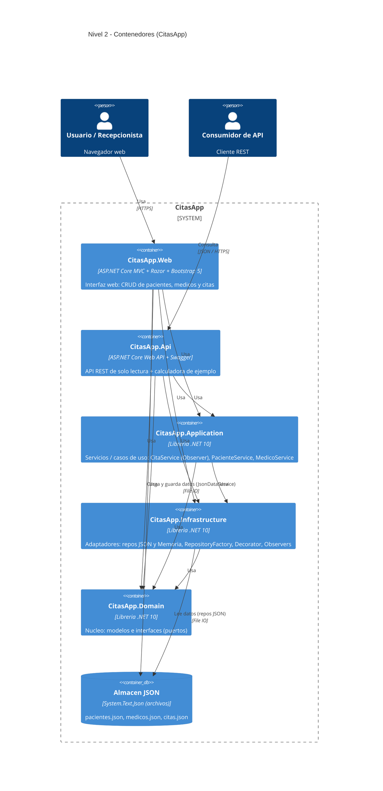
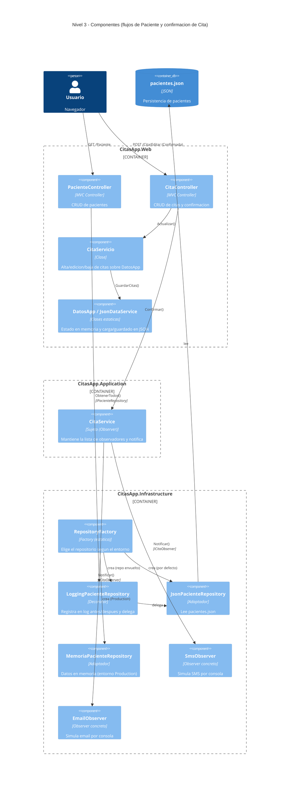
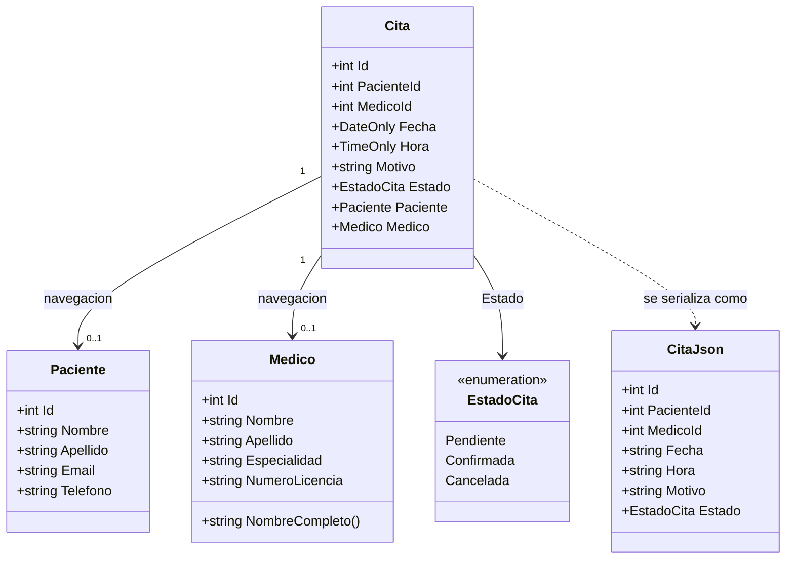
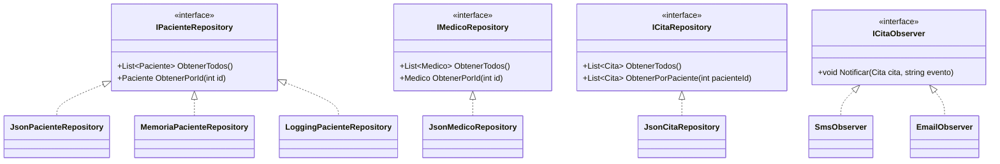
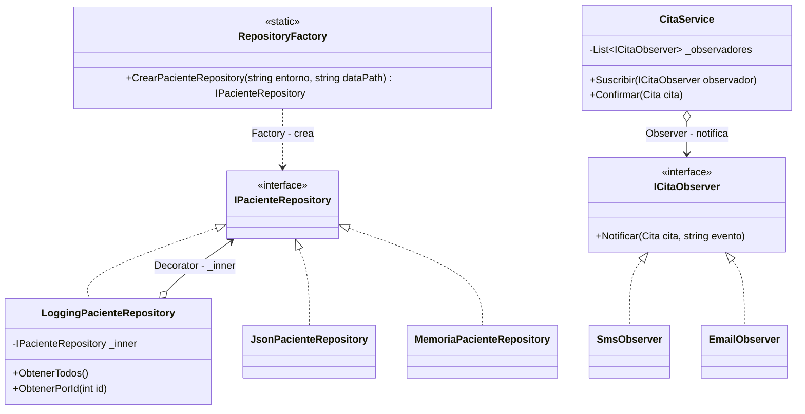
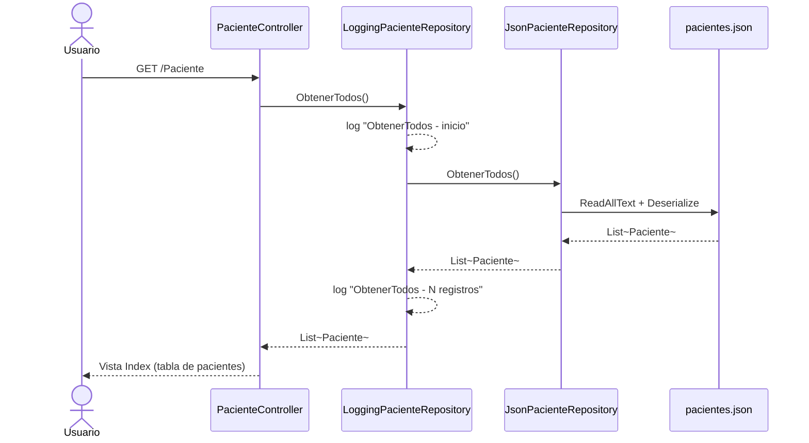
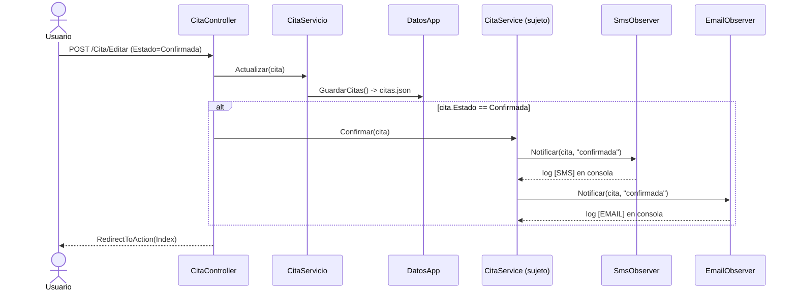

# CitasApp — Modelo C4 y documentación técnica

Este documento describe **CitasApp** siguiendo el **modelo C4** (Simon Brown): una jerarquía de
cuatro niveles de abstracción —**Contexto → Contenedores → Componentes → Código**— que permite
"hacer zoom" desde la visión general del sistema hasta las clases concretas.

Todos los diagramas están escritos en **Mermaid** (`C4Context`, `C4Container`, `C4Component` y
`classDiagram`) y reflejan el estado real del repositorio, no un modelo genérico.

> CitasApp es una solución .NET 10 multi‑proyecto (arquitectura hexagonal) para la gestión de
> citas médicas, con dos *hosts* que reutilizan el mismo núcleo (**Web MVC** y **API REST**),
> persistencia en archivos JSON y tres patrones GoF: **Factory**, **Decorator** y **Observer**.

| Nivel C4 | Pregunta que responde | Diagrama |
|---|---|---|
| **1 · Contexto** | ¿Quién usa el sistema y con qué interactúa? | [§1](#1-nivel-1--contexto-del-sistema) |
| **2 · Contenedores** | ¿De qué unidades desplegables/ejecutables se compone? | [§2](#2-nivel-2--contenedores) |
| **3 · Componentes** | ¿Qué componentes hay dentro de un contenedor y cómo colaboran? | [§3](#3-nivel-3--componentes) |
| **4 · Código** | ¿Cómo se implementan esos componentes (clases)? | [§4](#4-nivel-4--código-clases) |

---

## 1. Nivel 1 — Contexto del sistema

Visión de más alto nivel: los actores humanos, el sistema **CitasApp** como una caja negra, y los
sistemas externos con los que se comunica. Las notificaciones **SMS/Email** hoy están *simuladas*
(escriben en consola), pero se modelan como sistemas externos porque representan un canal fuera
del sistema.

---

## 2. Nivel 2 — Contenedores

Se abre la caja negra de CitasApp. Cada **contenedor** es una unidad ejecutable o una librería
desplegable. Aquí se ven los dos *hosts* (Web y API) y las tres librerías del núcleo hexagonal,
más el almacén de datos. Las flechas "usa" reflejan las `ProjectReference` reales de cada
`.csproj`; nótese que todas apuntan hacia el dominio.

---

## 3. Nivel 3 — Componentes

Se abre un contenedor para mostrar sus **componentes** internos y cómo colaboran. Se eligen los dos
flujos que concentran los patrones de diseño: el **listado de pacientes** (Factory + Decorator) y
la **confirmación de una cita** (Observer). Participan componentes de `Web`, `Infrastructure` y
`Application`.

---

## 4. Nivel 4 — Código (clases)

El nivel más detallado del C4 se expresa como diagramas de clases. Se dividen en tres vistas para
mantener la legibilidad: el **modelo de dominio**, los **puertos y adaptadores**, y las clases que
materializan cada **patrón GoF**.

### 4.1 Modelo de dominio

`Cita` guarda las claves foráneas (`PacienteId`, `MedicoId`) y, además, propiedades de navegación
opcionales que la capa web rellena para las vistas. `CitaJson` es el DTO usado para serializar
fechas/horas como texto.

### 4.2 Puertos (Domain) y adaptadores (Infrastructure)

### 4.3 Patrones GoF

**Factory** (`RepositoryFactory`) decide qué implementación crear según el entorno;
**Decorator** (`LoggingPacienteRepository`) envuelve a otro `IPacienteRepository` añadiendo logging
sin modificarlo (Open/Closed); **Observer** (`CitaService` + `SmsObserver`/`EmailObserver`) notifica
a los suscriptores al confirmar una cita.

---

## 5. Vistas dinámicas (secuencia)

Complementan el nivel de Componentes mostrando el orden temporal de las interacciones.

### 5.1 Listar pacientes — Factory + Decorator (Web)

### 5.2 Confirmar una cita — Observer (Web)

---

## 6. Detalle de implementación

### 6.1 Inyección de dependencias

**`CitasApp.Web/Program.cs`**
- `IPacienteRepository` → **Scoped**: `RepositoryFactory.CrearPacienteRepository(entorno, dataPath)`
  envuelto en `LoggingPacienteRepository` (Factory + Decorator).
- `CitaService` → **Singleton**: se le suscriben `SmsObserver` y `EmailObserver`.
- `CitaServicio` → **Singleton**: CRUD de citas sobre `DatosApp`.
- `DatosApp.Inicializar(...)` carga los JSON y siembra datos de ejemplo si están vacíos.

**`CitasApp.Api/Program.cs`**
- Repositorios JSON registrados directamente contra sus interfaces (**Scoped**).
- Servicios `PacienteService`, `MedicoService`, `CitaService` (**Scoped**).
- Swagger/OpenAPI bajo la ruta `/docs`.

### 6.2 Endpoints

**Web MVC**

| Controlador | Acciones |
|---|---|
| `HomeController` | `Index`, `Privacy`, `Error` |
| `PacienteController` | `Index`, `Detalle`, `Crear`, `Editar`, `Eliminar` |
| `MedicoController` | `Index`, `Detalle`, `Crear`, `Editar`, `Eliminar` |
| `CitaController` | `Index`, `PorPaciente`, `Crear`, `Editar`, `Eliminar` |

**API REST**

| Ruta | Método | Descripción |
|---|---|---|
| `/api/Pacientes` · `/api/Pacientes/{id}` | GET | Pacientes |
| `/api/Medicos` · `/api/Medicos/{id}` | GET | Médicos |
| `/api/Citas` · `/api/Citas/porpaciente/{pacienteId}` | GET | Citas |
| `/api/Calculadora/{sumar\|restar\|multiplicar\|dividir}` | GET | Aritmética de ejemplo |

### 6.3 Tecnologías

| Tecnología | Uso |
|---|---|
| **.NET 10 / ASP.NET Core** | Framework (MVC y Web API) |
| **C# 13** | Lenguaje (`ImplicitUsings`, `Nullable`, colecciones `[]`) |
| **Razor + Bootstrap 5** | Vistas del lado del servidor |
| **System.Text.Json** | Serialización de la persistencia |
| **Swashbuckle.AspNetCore 7.3.1** | Swagger/OpenAPI en `CitasApp.Api` |
| **JSON (archivos)** | Persistencia por defecto (`Data/json/`) |
