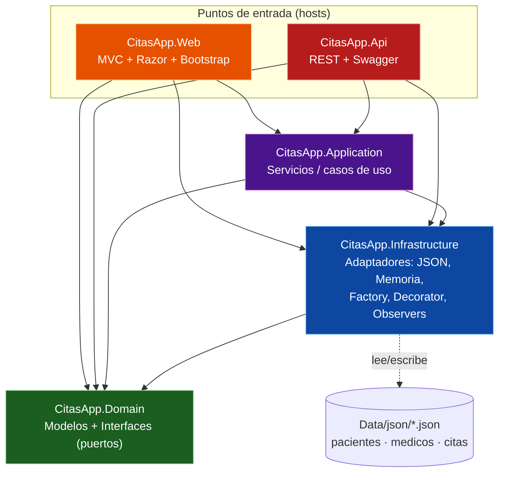
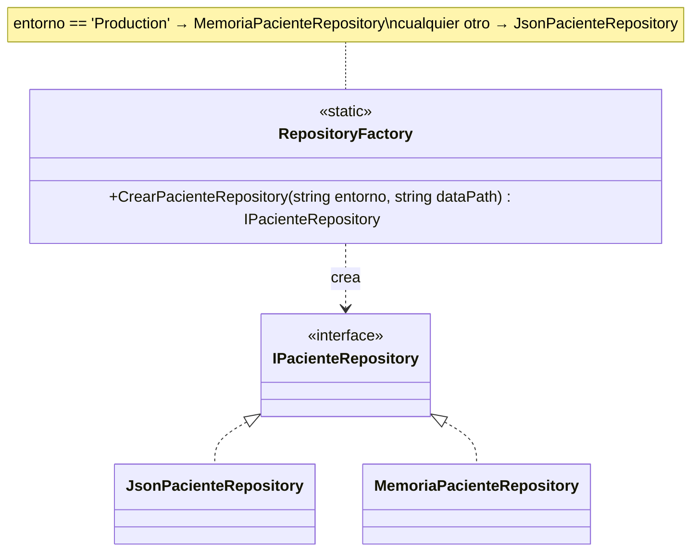
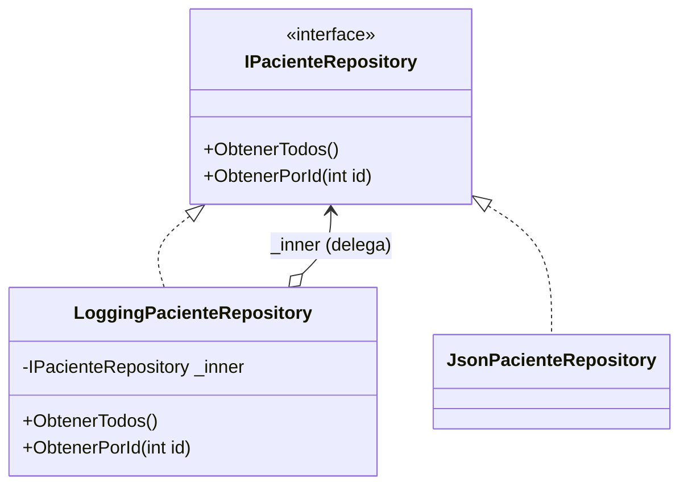
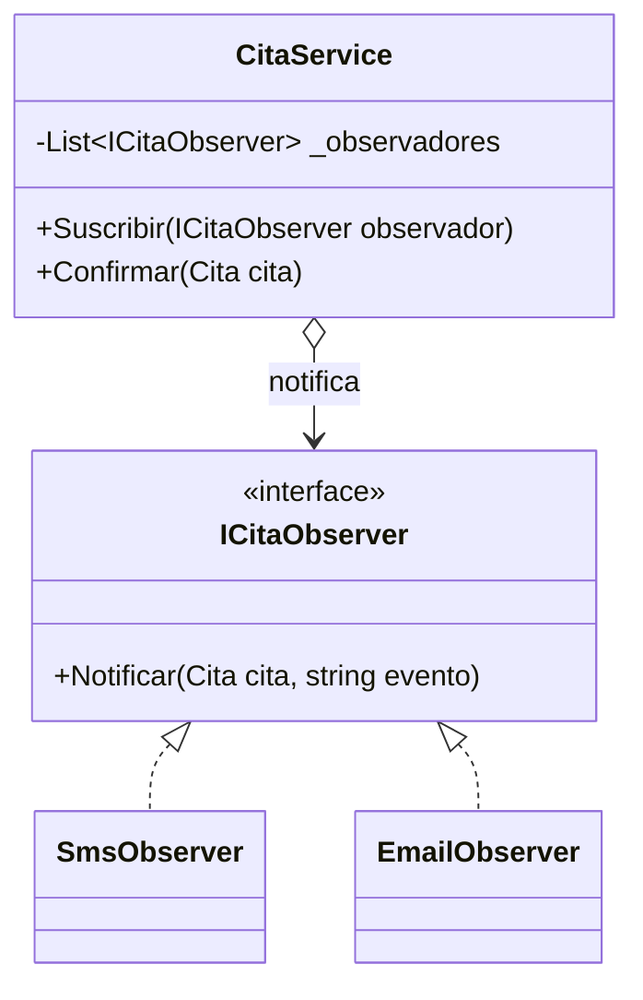
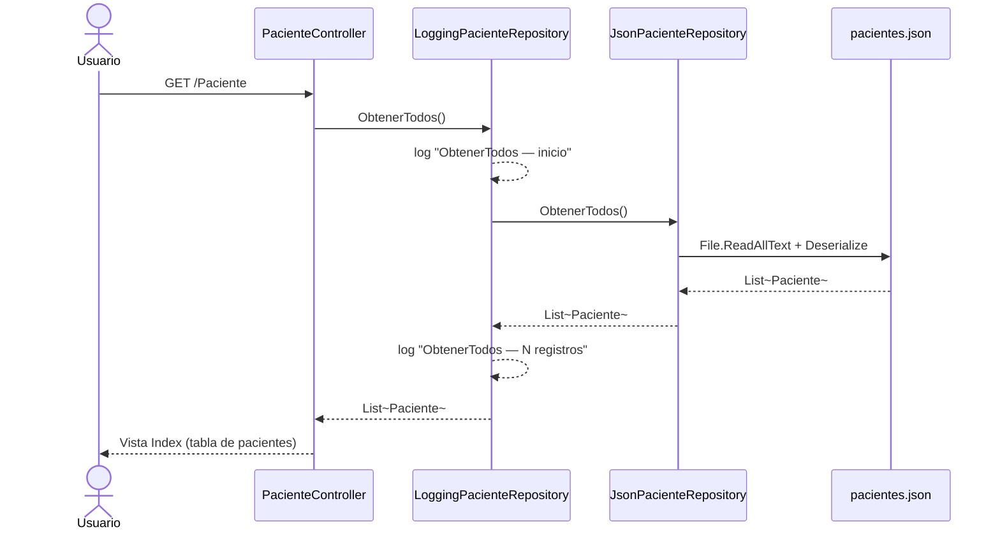
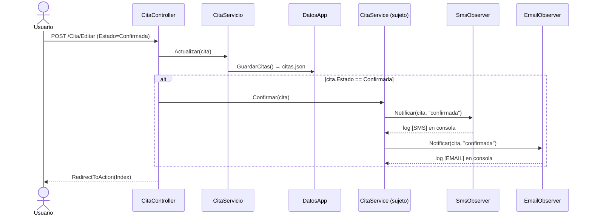

# CitasApp — Documentación técnica y diagramas

Especificación del estado real de **CitasApp**: una solución .NET 10 multi‑proyecto para la
gestión de citas médicas, construida sobre **arquitectura hexagonal** (puertos y adaptadores)
y con tres patrones de diseño GoF (**Factory**, **Decorator** y **Observer**) implementados de
forma efectiva sobre el dominio.

Todos los diagramas de este documento están escritos en **Mermaid** y describen el código tal
como existe hoy en el repositorio, no un modelo genérico.

---

## 1. Panorama general

La solución `CitasApp.sln` agrupa **cinco proyectos**:

| Proyecto | SDK | Rol | Depende de |
|---|---|---|---|
| **CitasApp.Domain** | `Microsoft.NET.Sdk` | Núcleo: modelos y puertos (interfaces). No depende de nadie. | — |
| **CitasApp.Infrastructure** | `Microsoft.NET.Sdk` | Adaptadores: repositorios JSON / memoria, observers, factory, decorator. | Domain |
| **CitasApp.Application** | `Microsoft.NET.Sdk` | Servicios de aplicación (casos de uso). | Domain, Infrastructure |
| **CitasApp.Web** | `Microsoft.NET.Sdk.Web` | Aplicación MVC + Razor (interfaz de usuario). | Domain, Infrastructure, Application |
| **CitasApp.Api** | `Microsoft.NET.Sdk.Web` | API REST + Swagger (segundo *host*). | Domain, Infrastructure, Application |

Existen **dos puntos de entrada** que reutilizan el mismo núcleo: la web MVC (`CitasApp.Web`) y
la API REST (`CitasApp.Api`). La persistencia por defecto son archivos JSON en
`CitasApp.Web/Data/json/` (`pacientes.json`, `medicos.json`, `citas.json`).

---

## 2. Diagrama de arquitectura y dependencias entre proyectos

Refleja las `ProjectReference` reales declaradas en cada `.csproj`. Nótese que las flechas de
dependencia apuntan **hacia el dominio**: el núcleo no conoce a nadie (regla de la arquitectura
hexagonal).

---

## 3. Modelo de dominio (diagrama de clases)

Entidades y enum del proyecto **CitasApp.Domain** (`namespace CitasApp.Models`). `Cita` mantiene
las claves foráneas (`PacienteId`, `MedicoId`) y además propiedades de navegación opcionales
(`Paciente?`, `Medico?`) que la capa web rellena para las vistas. `CitaJson` es el DTO usado para
serializar fechas/horas como texto.

---

## 4. Puertos y adaptadores (interfaces e implementaciones)

Las interfaces (puertos) viven en **Domain**; las implementaciones concretas (adaptadores) en
**Infrastructure**. La capa de aplicación y los controladores dependen solo de las interfaces.

---

## 5. Patrones de diseño GoF

### 5.1 Factory — `RepositoryFactory`

Clase estática que decide **qué implementación de `IPacienteRepository` instanciar** según el
entorno de ejecución. El consumidor queda desacoplado del repositorio concreto.

### 5.2 Decorator — `LoggingPacienteRepository`

Implementa `IPacienteRepository` y **envuelve** a otro `IPacienteRepository`, añadiendo logging
en consola antes y después de cada operación sin modificar el repositorio real (principio
Open/Closed). Al ser también un `IPacienteRepository`, los decoradores son apilables.

### 5.3 Observer — `CitaService` + observadores

`CitaService` (el **sujeto**, en Application) mantiene una lista de `ICitaObserver` y notifica a
todos al confirmar una cita. Solo conoce la interfaz `ICitaObserver` (Domain); nunca a los
observadores concretos `SmsObserver` / `EmailObserver` (Infrastructure). La suscripción ocurre en
`Program.cs` (capa Web), único punto donde convergen todas las capas.

---

## 6. Flujos en tiempo de ejecución (diagramas de secuencia)

### 6.1 Listar pacientes — Factory + Decorator (Web)

En `Program.cs`, `IPacienteRepository` se registra en el contenedor DI como un
`LoggingPacienteRepository` que envuelve al repositorio elegido por la Factory. Cuando
`PacienteController.Index()` pide los pacientes, la llamada atraviesa el decorador antes de llegar
al repositorio JSON.

### 6.2 Confirmar una cita — Observer (Web)

Al editar una cita y guardarla con estado `Confirmada`, `CitaController.Editar` persiste el cambio
vía `CitaServicio` y luego dispara la notificación por medio de `CitaService.Confirmar`, que avisa
a cada observador suscrito.

---

## 7. Inyección de dependencias

### 7.1 `CitasApp.Web/Program.cs`

- `IPacienteRepository` → **Scoped**: `RepositoryFactory.CrearPacienteRepository(entorno, dataPath)`
  envuelto en un `LoggingPacienteRepository` (Factory + Decorator combinados).
- `CitaService` → **Singleton**: se crea y se le suscriben `SmsObserver` y `EmailObserver`.
- `CitaServicio` → **Singleton**: CRUD de citas sobre `DatosApp`.
- Datos en memoria inicializados con `DatosApp.Inicializar(...)`, que carga los JSON y siembra
  datos de ejemplo (*seed*) si los archivos están vacíos.

### 7.2 `CitasApp.Api/Program.cs`

- Repositorios JSON registrados directamente contra sus interfaces
  (`IPacienteRepository → JsonPacienteRepository`, etc.).
- Servicios de aplicación `PacienteService`, `MedicoService`, `CitaService` como **Scoped**.
- Swagger/OpenAPI expuesto bajo la ruta `/docs`.

---

## 8. Mapa de endpoints

### Web MVC (`CitasApp.Web`)

| Controlador | Acciones | Persistencia |
|---|---|---|
| `HomeController` | `Index`, `Privacy`, `Error` | — |
| `PacienteController` | `Index`, `Detalle`, `Crear`, `Editar`, `Eliminar` | `IPacienteRepository` + `DatosApp` |
| `MedicoController` | `Index`, `Detalle`, `Crear`, `Editar`, `Eliminar` | `DatosApp` |
| `CitaController` | `Index`, `PorPaciente`, `Crear`, `Editar`, `Eliminar` | `CitaServicio` + `DatosApp` (+ `CitaService` para notificar) |

### API REST (`CitasApp.Api`)

| Ruta | Método | Descripción |
|---|---|---|
| `/api/Pacientes` | GET | Lista de pacientes |
| `/api/Pacientes/{id}` | GET | Paciente por id |
| `/api/Medicos` | GET | Lista de médicos |
| `/api/Medicos/{id}` | GET | Médico por id |
| `/api/Citas` | GET | Lista de citas |
| `/api/Citas/porpaciente/{pacienteId}` | GET | Citas de un paciente |
| `/api/Calculadora/{sumar\|restar\|multiplicar\|dividir}` | GET | Operaciones aritméticas de ejemplo |

---

## 9. Tecnologías

| Tecnología | Uso |
|---|---|
| **.NET 10 / ASP.NET Core** | Framework (MVC y Web API) |
| **C# 13** | Lenguaje (`ImplicitUsings`, `Nullable` habilitados; colecciones `[]`) |
| **Razor + Bootstrap 5** | Vistas del lado del servidor |
| **System.Text.Json** | Serialización de la capa de persistencia |
| **Swashbuckle.AspNetCore 7.3.1** | Swagger/OpenAPI en `CitasApp.Api` |
| **JSON (archivos)** | Persistencia por defecto (`Data/json/`) |
